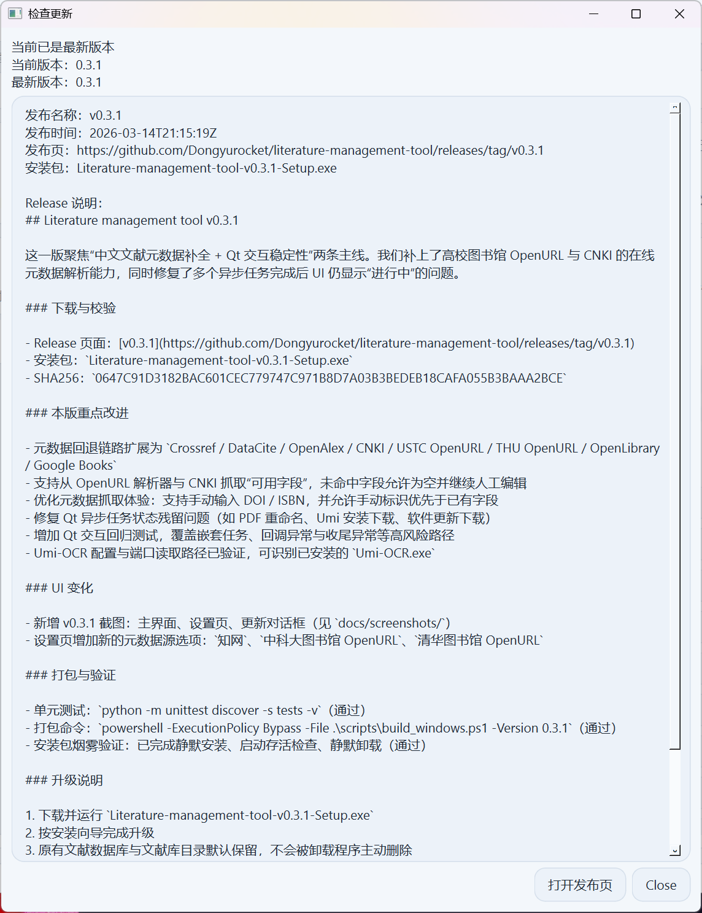

# Literature management tool


一个面向本地资料管理场景的桌面文献管理软件，适合研究生、教师、工程师和需要长期维护 PDF / 笔记 / BibTeX 数据的用户。项目使用 `Python + PySide6 + sqlite3 + pypdf` 构建，现已完成 Qt 桌面版迁移，默认本地存储，不依赖服务器即可运行。

仓库地址：[GitHub](https://github.com/Dongyurocket/literature-management-tool)  
最新发布页：[Releases](https://github.com/Dongyurocket/literature-management-tool/releases/latest)  
安装版下载：请前往 [最新 Release](https://github.com/Dongyurocket/literature-management-tool/releases/latest) 获取 `Setup.exe`

## V0.4.0 更新

这一版聚焦元数据抓取体验，恢复元数据源多选，并按用户配置顺序逐一尝试抓取；一旦成功命中，就立即停止后续来源，避免无意义请求和多源混合结果。

- 设置页恢复元数据源多选，可自由勾选需要参与回退的来源
- 元数据抓取按已选来源顺序逐一尝试，命中即停，不再继续下一个来源
- 保留来源顺序保存逻辑，重开设置后不会丢失你的回退优先级
- 补充对应界面测试与服务层测试，覆盖多选顺序保存和“成功即停”的回退行为
- 延续 `V0.3.5` 的安装包启动修复、`Pillow` 依赖补齐和 PyInstaller 打包稳定性改进

## V0.3.5 热修复

这一版聚焦 Windows 安装包启动稳定性，修复部分打包结果里 `PIL` 包不完整，导致程序启动时直接报错 `module 'PIL' has no attribute '__version__'` 的问题。

- `metadata_service` 在导入 `pypdf` 前增加兼容保护，避免不完整的 `PIL` 模块触发启动异常
- 打包规格文件显式收集完整的 `Pillow / PIL` 模块内容，避免 PyInstaller 只带入二进制扩展却遗漏 `__init__.py`
- 运行时依赖补充 `Pillow`，保证源码安装、本地打包、CI 发布环境一致
- 新增回归测试，覆盖“`PIL` 模块存在但缺少 `__version__`”场景
- 已完成全量测试、Windows 安装包重打包与启动烟雾验证

## V0.3.4 更新

这一版聚焦工程化体验和桌面版稳定性，补齐开发依赖安装入口，并继续优化数据库、MVVM 分层和后台任务处理。

- 新增 `dev` extra，可通过 `python -m pip install -e ".[dev]"` 一次安装开发、测试和本地打包依赖
- SQLite 默认启用 `WAL`，并为 `year`、`subject`、`reading_status` 增加索引，降低并发访问与列表筛选压力
- 文献列表中的附件/笔记数量改为聚合统计，减少重复子查询
- `MainWindowViewModel` 新增元数据保存、新建文献、删除文献等封装，降低 View 对 Controller 的直接耦合
- 元数据页增加“脏检查”，未改动时不再触发无意义写库
- `AsyncWorker` 返回结构化错误信息，界面侧统一处理异步失败提示
- 全量测试已验证通过：`49` 项 `unittest`

## V0.3.3 热修复

这一版聚焦“检查更新”的稳定性，修复部分环境下 GitHub API 返回 `HTTP 403` 直接报错的问题。

- 检查更新支持自动回退到 Release 网页解析（API 403 / 429 / 网络异常时）
- 支持读取 `GITHUB_TOKEN` / `GH_TOKEN`，提升受限网络下的成功率
- 更新弹窗新增来源提示，明确当前是 API 结果还是网页回退结果
- 补充对应单元测试，覆盖回退成功和回退失败两条路径

## V0.3.2 更新

这一版聚焦“可感知反馈 + 稳定性收敛”：新增文献列表手动刷新，并继续修复“操作已完成但右下角仍显示正在运行”的问题，同时补齐元数据合并与可编辑性的细节体验。

- 新增文献列表刷新能力（顶部 `刷新列表` 按钮 + `F5` 快捷键）
- 刷新前自动保存当前编辑中的元数据，避免刷新后内容丢失
- 增加后台任务状态守护，异常残留时可自动恢复到“就绪”
- 元数据抓取改为每次仅使用一个已选来源，避免多源混合回退
- 优化元数据合并：支持替换占位标题、作者去重合并、关键词去重合并
- 引用键（cite_key）支持手动编辑并自动保存
- 已完成 Windows 安装包打包与启动烟雾验证，回归测试通过

### 新界面截图（v0.3.2，界面布局延续 v0.3.1）

主界面（文献列表、详情编辑、顶部工具入口）：


设置页（元数据源、OCR、更新配置）：


更新对话框（版本信息与下载入口）：



## 核心能力速览

| 模块 | 当前支持 |
| --- | --- |
| 元数据 | GB/T 7714 常用字段、主题、关键词、一句话简介、摘要、备注、阅读状态、评分、引用键、中文化字段说明 |
| 文件管理 | 自定义文献库目录，支持 `copy / move / link` 三种导入方式，原文 / 译文 / 补充材料多附件关联 |
| 笔记系统 | 内置文本笔记，外部 `docx / md / txt` 笔记，支持预览与全文检索 |
| 批量工具 | BibTeX、CSL JSON、GB/T 文本导出，Markdown / CSV / HTML 模板导出，PDF 批量重命名 |
| 维护能力 | 查重合并、字段级重复对比、缺失路径修复、备份恢复、索引重建、统计报表 |
| 桌面体验 | PySide6 / Qt、中文界面、惰性表格加载、拖拽导入、后台任务、非阻塞 toast 提示、软件内检查更新 |
| 多库管理 | 多文库切换、归档库、每个文库独立数据库与设置 |

## 为什么做这个工具

很多轻量文献工具只能保存标题和 PDF，难以覆盖国内常用的 GB/T 7714-2015 参考文献整理需求，也不方便把原文、翻译稿、阅读笔记、导出文件统一管理。本项目重点解决以下问题：

- 文献信息字段不完整，难以满足国标参考文献整理
- PDF、译文、补充材料、笔记分散在多个文件夹，后期难维护
- 现有资料批量导入困难，BibTeX 输出不顺手
- 笔记既想支持内置文本，也想关联 `docx / md / txt` 外部文件
- 本地移动文件后路径失效，缺少修复、查重、备份和恢复能力

## 适合谁使用

- 需要本地优先管理 PDF、翻译稿、补充材料和笔记的研究生、教师、工程师
- 需要维护 GB/T 7714-2015 字段，同时还要导出 BibTeX 或 CSL JSON 的用户
- 希望把文献条目、附件、笔记、导出文件集中到一个 Windows 桌面工具里的个人或小团队

## 功能总览

### 1. 文献信息管理

每条文献都可以维护完整的结构化元数据，覆盖 GB/T 7714-2015 常见整理字段，并额外支持研究流程需要的信息：

- 文献类型：期刊论文、图书、学位论文、会议论文、标准、专利、报告、网页、其他
- 标题、译名 / 副标题
- 作者列表（保留顺序）
- 期刊 / 书名 / 会议名 / 出版社 / 学校 / 机构
- 年、月、卷、期、页码
- DOI、ISBN、URL、语言、国家 / 地区
- 主题、关键词、一句话简介、摘要、备注
- 阅读状态、评分、标签、引用键

### 2. 文献文件管理

你可以自定义文献库目录，并将文献附件与软件关联。每条文献可以挂接多个文件：

- 原文 PDF
- 翻译稿 PDF
- 补充材料
- 数据文件
- 笔记文件

支持三种导入方式：

- `copy`：复制到文献库目录
- `move`：移动到文献库目录
- `link`：保留原位置，仅记录关联关系

### 3. PDF 自动命名

支持按规则批量重命名 PDF，命名逻辑为：

- `作者_年份_标题_Original.pdf`
- `作者_年份_标题_Translation.pdf`

同名冲突会自动追加序号，避免覆盖已有文件。

### 4. 笔记系统

每条文献既可以使用内置文本笔记，也可以关联外部笔记文件。

支持的外部笔记格式：

- `docx`
- `md`
- `txt`

并且支持：

- 一个笔记关联多个附件
- 一个文献维护多条笔记
- 文件笔记与文本笔记混合使用
- 预览外部笔记内容并参与全文检索

### 5. 批量导出与引用

支持从当前选择的多条文献中批量生成：

- `BibTeX (.bib)`
- `CSL JSON (.json)`
- 国标 GB/T 7714 参考文献文本（可直接复制到剪贴板）

### 6. 元数据导入与补全

当前版本支持：

- DOI 查询补全元数据
- ISBN 查询补全元数据
- 当 DOI / ISBN 不可用或查询失败时，自动按标题回退检索
- 元数据源可配置为 `Crossref -> DataCite -> OpenAlex -> CNKI -> USTC OpenURL -> THU OpenURL -> OpenLibrary -> Google Books`
- 支持从图书馆 OpenURL 解析器补充在线检索到的可用字段，并保留检索链接
- 支持从知网抓取中文文章的可用元数据字段
- 元数据字段允许部分补全，未抓到的字段可留空并继续手动编辑
- 从 `bib / ris / pdf / docx / md / txt` 导入资料
- 导入中心批量扫描和导入

### 7. 检索、查重与维护

当前版本支持：

- 全文检索（元数据、文本笔记、`docx` 笔记、提取到的 PDF 文本）
- 重复文献检测与合并
- 重复项字段级冲突对比与合并预览
- 丢失路径扫描
- 通过新目录扫描修复失效文件路径
- 备份与恢复
- 搜索索引重建
- 统计面板与导出报表

### 8. OCR 与扫描版 PDF

针对扫描版 PDF，本项目现在提供两种 OCR 方式：

- 可以在设置中直接下载安装 `Umi-OCR`（支持 `Rapid` / `Paddle` 两个发布包）
- 程序会自动定位 `Umi-OCR.exe`、读取 Umi 的实际 HTTP 服务端口，并调用官方文档识别接口
- 也可以自定义 OCR 命令模板，使用 `{umi_ocr}`、`{input}`、`{output}` 占位符
- 当 PDF 内置文本过少时，系统会自动尝试 OCR 结果作为补充
- 也可以对当前选中的 PDF 批量重新执行 OCR 提取

这样做的好处是：

- 默认就能走 `Umi-OCR` 官方发布包，不需要手工找命令参数
- 仍然保留外部命令模式，方便接入你自己的 OCR 脚本
- 后续可以继续扩展更细的 OCR 参数和任务日志

### 9. 软件内更新

支持通过 GitHub Release 检查并下载更新：

- 在主界面点击 `检查更新`
- 软件会读取配置中的 GitHub 仓库（默认当前项目仓库）
- 若存在新版本，会展示 Release 说明并支持下载 `Setup.exe`
- 下载完成后可手动执行安装包完成升级

### 10. 自定义 PDF 阅读器

可以在软件设置中指定 PDF 阅读器路径。打开 PDF 附件时：

- 若已配置自定义阅读器，则优先使用该软件打开
- 若未配置，则调用系统默认程序打开

### 11. 多文库与归档库

当前已支持多文库模式，每个文库拥有各自独立的数据文件：

- 每个文库都有独立的 `settings.json`
- 每个文库都有独立的 `library.sqlite3`
- 可以在主界面直接切换当前文库
- 不常用文库可以标记为“已归档”
- 归档不会删除数据，只是从日常工作流中隐藏

### 12. 模板导出与统计报表

除了 BibTeX / CSL JSON / GB/T 文本外，现还支持：

- 文献模板导出
  - `Markdown` 文献综述
  - `CSV` 文献目录
  - `HTML` 阅读报告
  - `GB/T` 纯文本
- 统计报表导出
  - `Markdown` 统计报表
  - `JSON` 统计报表

### 13. Qt 桌面体验与后台任务

Qt 版本针对高频操作补了更完整的桌面交互：

- 惰性加载文献表格，大批量数据滚动更流畅
- 支持文件和文件夹拖拽导入
- 维护中心、导入中心、全文检索、查重、重命名等功能集中到统一工具入口
- 后台任务执行期间使用状态栏进度和 toast 提示，避免长任务阻塞界面
- 通过 controller 克隆隔离数据库连接，减少跨线程 SQLite 读写冲突

## 安装方式

### 推荐：下载 Windows 安装版 `Setup.exe`

进入 [最新 Release](https://github.com/Dongyurocket/literature-management-tool/releases/latest) 下载：

- 当前 Release 中提供的 `Literature-management-tool-*-Setup.exe`

安装版特性：

- 带中文安装向导
- 支持开始菜单快捷方式
- 可选桌面快捷方式
- 自带卸载入口
- 默认安装到当前用户目录，无需管理员权限

注意：卸载程序不会主动删除你的文献数据库和文献库文件，已有数据会保留在本地。

### 从源码运行

环境要求：

- Windows 10 / 11
- Python `3.11+`

安装依赖：

```bash
python -m pip install -U pip
python -m pip install .
```

如果你需要开发、跑测试或本地打包，建议直接安装开发依赖：

```bash
python -m pip install -U pip
python -m pip install -e ".[dev]"
```

启动程序：

```bash
python main.py
```

如果你需要自己打包安装版，请直接看后面的“本地打包”章节。

## 首次使用建议

第一次启动后，建议按下面顺序完成初始化：

1. 打开 `设置`
2. 指定 `文献库目录`
3. 选择默认导入方式
4. 按需配置 `PDF 阅读器`
5. 如果需要扫描版 PDF，在 `设置 -> OCR / 扫描版 PDF` 中点击 `下载安装`
6. 如需内置更新，确认 `GitHub 仓库` 配置正确
7. 开始创建文献或导入已有资料

## 典型工作流

### 手动录入一篇文献

1. 点击 `新建文献`
2. 填写标题、作者、年份、主题、关键词、一句话简介等字段
3. 补充 DOI / ISBN / 摘要 / 备注等信息
4. 保存文献
5. 添加原文、译文或其他附件
6. 在 `笔记` 区添加文本笔记或关联 `docx` 笔记

### 批量导入已有资料

1. 点击 `导入中心`
2. 选择文件或整个目录
3. 审核扫描结果
4. 选择导入方式（复制 / 移动 / 仅关联）
5. 执行导入

### 批量导出 Bib 文件

1. 在主列表中多选文献
2. 点击 `导出 Bib`
3. 选择输出位置
4. 生成 `.bib` 文件

### 批量重命名 PDF

1. 选中一条或多条文献
2. 点击 `重命名 PDF`
3. 预览命名结果
4. 确认执行

### 使用 DOI / ISBN 补全文献信息

1. 选中文献
2. 点击 `抓取元数据`
3. 自动或手动输入 DOI / ISBN
4. 预览补全结果
5. 应用缺失字段

### 路径修复

当你手动移动过文件或更换硬盘目录时：

1. 打开 `维护工具`
2. 刷新缺失文件列表
3. 选择可能的新目录
4. 执行修复扫描

## 数据存储说明

程序默认采用本地优先存储。

默认数据目录：

- `%APPDATA%\Literature management tool`

通常包含：

- `profiles/<slug>/library.sqlite3`：当前文库数据库
- `profiles/<slug>/settings.json`：当前文库设置
- `library_registry.json`：文库注册表
- 备份恢复后的本地文件

如果需要切换应用数据目录，可设置环境变量：

- `LITERATURE_MANAGER_HOME`

## 技术架构

当前代码已按 Qt 桌面应用的职责拆分：

- `controllers/`：协调数据库、导入、查重、维护、导出等业务流程
- `viewmodels/`：为 Qt 视图整理导航、表格行和详情展示数据
- `views/`：主窗口、工具对话框、主题、toast、搜索条、后台任务等 Qt 组件
- `models/`：`QAbstractTableModel` 等 Qt 数据模型
- `desktop.py`：本地文件打开、定位、调用自定义 PDF 阅读器
- `db.py` 与各类 `*_service.py`：本地持久化与领域能力

这样做的主要收益：

- 更容易继续扩展 GUI，而不是把所有逻辑塞进单个界面文件
- 更适合后续补自动化测试
- 更利于把长耗时任务切到后台线程执行

## 目录结构

```text
literature-management-tool/
|- literature_manager/
|  |- app.py
|  |- config.py
|  |- db.py
|  |- dedupe_service.py
|  |- desktop.py
|  |- export_service.py
|  |- import_service.py
|  |- maintenance_service.py
|  |- metadata_service.py
|  |- ocr_service.py
|  |- qt_app.py
|  |- update_service.py
|  |- utils.py
|  |- controllers/
|  |- models/
|  |- viewmodels/
|  |- views/
|- installer/
|  |- LiteratureManagementTool.iss
|- scripts/
|  |- build_windows.ps1
|- tests/
|- docs/
|  |- releases/
|- .github/workflows/
|  |- build-windows-release.yml
|- LiteratureManagementTool.spec
|- LICENSE
|- README.md
|- main.py
|- pyproject.toml
```

## 本地打包

### 生成 Windows 安装包

先安装开发 / 打包依赖：

```bash
python -m pip install -U pip
python -m pip install -e ".[dev]"
```

再安装 Inno Setup（任选其一）：

```powershell
winget install --id JRSoftware.InnoSetup -e --accept-source-agreements --accept-package-agreements
```

执行打包：

```powershell
powershell -ExecutionPolicy Bypass -File .\scripts\build_windows.ps1 -Version 0.4.0
```

输出内容：

- `dist\Literature management tool\`：PyInstaller 生成的可运行目录
- `dist\Literature-management-tool-v0.4.0-Setup.exe`：带中文安装向导的 Windows 安装包

当前仓库版本已实际验证可生成 `Setup.exe`，并已通过静默安装 / 卸载烟雾测试，适合直接用于本地安装与 Release 上传。

### GitHub Actions 自动发布

当推送形如 `v0.4.0` 的标签时：

1. GitHub Actions 在 Windows runner 上检出代码
2. 安装 Python 依赖和 Inno Setup
3. 运行 `scripts/build_windows.ps1`
4. 将 `Setup.exe` 上传到对应 Release

工作流文件：

- `.github/workflows/build-windows-release.yml`

## 测试

推荐先安装开发依赖：

```bash
python -m pip install -e ".[dev]"
```

运行全量单元测试（PowerShell）：

```powershell
$env:QT_QPA_PLATFORM='offscreen'
python -m unittest discover -s tests -v
```

也可以使用 `pytest`：

```powershell
$env:QT_QPA_PLATFORM='offscreen'
python -m pytest -q
```

可选语法检查：

```bash
python -m compileall main.py literature_manager
```

## 当前版本亮点（V0.4.0）

- 元数据源支持多选，并按配置顺序逐一回退尝试
- 抓取到元数据后立即停止后续来源，减少不必要请求和混合结果
- 设置页会保留多选来源的顺序，方便长期维护自己的抓取优先级
- 安装包启动兼容性修复仍然保留，`Pillow / PIL` 打包更稳定
- 开发环境继续支持 `python -m pip install -e ".[dev]"` 一键安装测试和打包依赖
- 全量 `unittest` / `pytest` 现已验证 `51` 项通过

## 已知限制

- Umi-OCR 首次下载安装体积较大，需保持网络可用并等待完成
- PDF 元数据抽取仍是尽力而为
- 查重合并策略偏保守，需要人工确认
- 当前不包含云同步

## 隐私与安全

- 默认所有文献数据都保存在本地
- DOI / ISBN 补全只会发送查询标识到外部服务
- 备份压缩包可能包含你的原始文献文件，请自行妥善保管
- 若仓库保持公开，提交前请确认没有把个人资料或文献原文一并上传

## 后续可扩展方向

- 更丰富的导出模板自定义能力
- 更细的 OCR 参数面板与任务日志
- 更强的批量元数据清洗规则
- 更完整的合并冲突编辑器
- 可选的局域网同步或团队协作能力

## License

本项目采用 [MIT License](LICENSE)。
