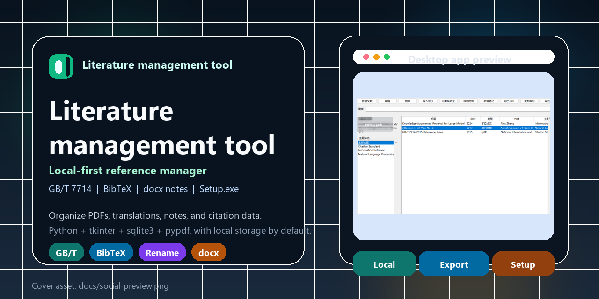
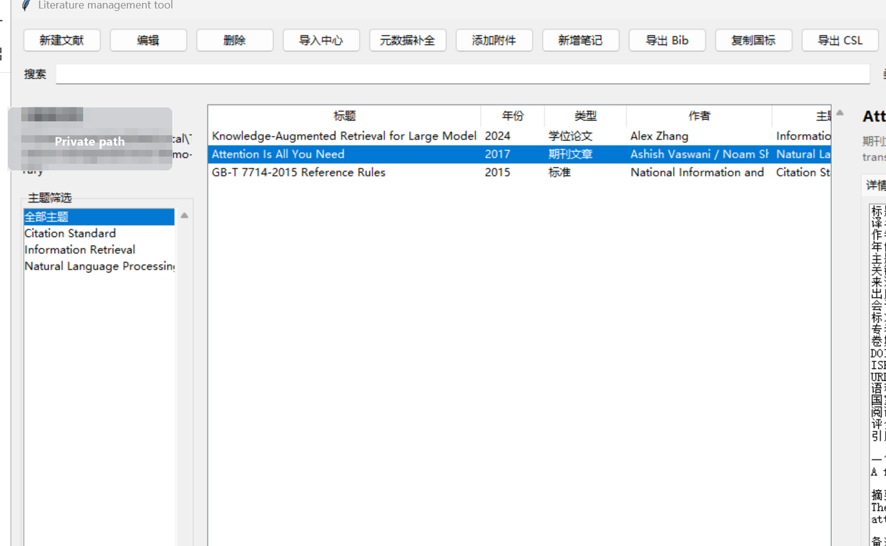
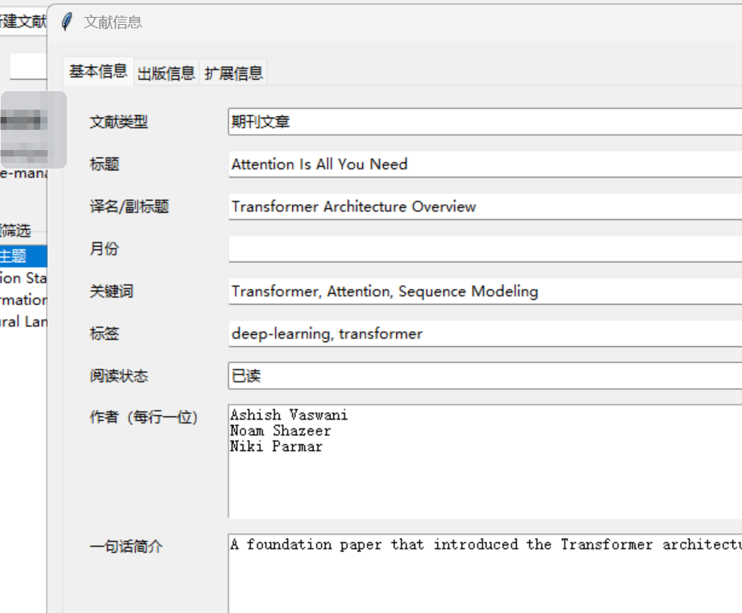
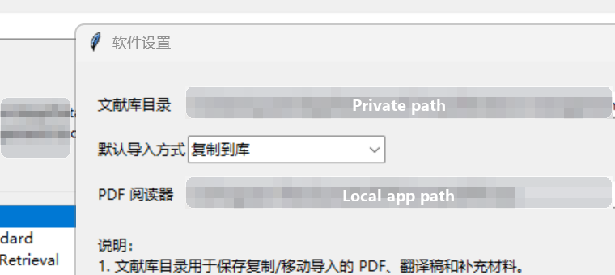

# Literature management tool


一个面向本地资料管理场景的桌面文献管理软件，适合研究生、教师、工程师和需要长期维护 PDF / 笔记 / BibTeX 数据的用户。项目使用 `Python + tkinter + sqlite3 + pypdf` 构建，默认本地存储，不依赖服务器即可运行。

仓库地址：[GitHub](https://github.com/Dongyurocket/literature-management-tool)  
最新发布页：[Releases](https://github.com/Dongyurocket/literature-management-tool/releases/latest)



说明：README 与 Release 中使用的界面截图已对本地路径等隐私地址做打码处理。

## 为什么做这个工具

很多轻量文献工具只能保存标题和 PDF，难以覆盖国内常用的 GB/T 7714-2015 参考文献整理需求，也不方便把原文、翻译稿、阅读笔记、导出文件统一管理。本项目重点解决以下问题：

- 文献信息字段不完整，难以满足国标参考文献整理
- PDF、译文、补充材料、笔记分散在多个文件夹，后期难维护
- 现有资料批量导入困难，BibTeX 输出不顺手
- 笔记既想支持内置文本，也想关联 `docx / md / txt` 外部文件
- 本地移动文件后路径失效，缺少修复、查重、备份和恢复能力

## 首页预览

### 主界面



### 文献信息编辑



### 设置与阅读器配置



## 功能总览

### 1. 文献信息管理

每条文献都可以维护完整的结构化元数据，覆盖 GB/T 7714-2015 常见整理字段，并额外支持研究流程需要的信息：

- 文献类型：期刊论文、图书、学位论文、会议论文、标准、专利、报告、网页、其他
- 标题、译名 / 副标题
- 作者列表（保留顺序）
- 期刊 / 书名 / 会议名 / 出版社 / 学校 / 机构
- 年、月、卷、期、页码
- DOI、ISBN、URL、语言、国家 / 地区
- 主题、关键词、一句话简介、摘要、备注
- 阅读状态、评分、标签、引用键

### 2. 文献文件管理

你可以自定义文献库目录，并将文献附件与软件关联。每条文献可以挂接多个文件：

- 原文 PDF
- 翻译稿 PDF
- 补充材料
- 数据文件
- 笔记文件

支持三种导入方式：

- `copy`：复制到文献库目录
- `move`：移动到文献库目录
- `link`：保留原位置，仅记录关联关系

### 3. PDF 自动命名

支持按规则批量重命名 PDF，命名逻辑为：

- `作者_年份_标题_Original.pdf`
- `作者_年份_标题_Translation.pdf`

同名冲突会自动追加序号，避免覆盖已有文件。

### 4. 笔记系统

每条文献既可以使用内置文本笔记，也可以关联外部笔记文件。

支持的外部笔记格式：

- `docx`
- `md`
- `txt`

并且支持：

- 一个笔记关联多个附件
- 一个文献维护多条笔记
- 文件笔记与文本笔记混合使用
- 预览外部笔记内容并参与全文检索

### 5. 批量导出与引用

支持从当前选择的多条文献中批量生成：

- `BibTeX (.bib)`
- `CSL JSON (.json)`
- 国标 GB/T 7714 参考文献文本（可直接复制到剪贴板）

### 6. 元数据导入与补全

V2 已支持：

- DOI 查询补全元数据
- ISBN 查询补全元数据
- 从 `bib / ris / pdf / docx / md / txt` 导入资料
- 导入中心批量扫描和导入

### 7. 检索、查重与维护

V2 已支持：

- 全文检索（元数据、文本笔记、`docx` 笔记、提取到的 PDF 文本）
- 重复文献检测与合并
- 丢失路径扫描
- 通过新目录扫描修复失效文件路径
- 备份与恢复
- 搜索索引重建
- 统计面板

### 8. 自定义 PDF 阅读器

可以在软件设置中指定 PDF 阅读器路径。打开 PDF 附件时：

- 若已配置自定义阅读器，则优先使用该软件打开
- 若未配置，则调用系统默认程序打开

## 安装方式

### 推荐：下载 Windows 安装版 `Setup.exe`

进入 [最新 Release](https://github.com/Dongyurocket/literature-management-tool/releases/latest) 下载：

- `Literature-management-tool-v0.2.2-Setup.exe`

安装版特性：

- 带安装向导
- 支持开始菜单快捷方式
- 可选桌面快捷方式
- 自带卸载入口
- 默认安装到当前用户目录，无需管理员权限

注意：卸载程序不会主动删除你的文献数据库和文献库文件，已有数据会保留在本地。

### 从源码运行

环境要求：

- Windows 10 / 11
- Python `3.11+`

安装依赖：

```bash
python -m pip install -U pip
python -m pip install pypdf
```

启动程序：

```bash
python main.py
```

## 首次使用建议

第一次启动后，建议按下面顺序完成初始化：

1. 打开 `设置`
2. 指定 `文献库目录`
3. 选择默认导入方式
4. 按需配置 `PDF 阅读器`
5. 开始创建文献或导入已有资料

## 典型工作流

### 手动录入一篇文献

1. 点击 `新建文献`
2. 填写标题、作者、年份、主题、关键词、一句话简介等字段
3. 补充 DOI / ISBN / 摘要 / 备注等信息
4. 保存文献
5. 添加原文、译文或其他附件
6. 在 `笔记` 区添加文本笔记或关联 `docx` 笔记

### 批量导入已有资料

1. 点击 `导入中心`
2. 选择文件或整个目录
3. 审核扫描结果
4. 选择导入方式（复制 / 移动 / 仅关联）
5. 执行导入

### 批量导出 Bib 文件

1. 在主列表中多选文献
2. 点击 `导出 Bib`
3. 选择输出位置
4. 生成 `.bib` 文件

### 批量重命名 PDF

1. 选中一条或多条文献
2. 点击 `重命名 PDF`
3. 预览命名结果
4. 确认执行

### 使用 DOI / ISBN 补全文献信息

1. 选中文献
2. 点击 `元数据补全`
3. 自动或手动输入 DOI / ISBN
4. 预览补全结果
5. 应用缺失字段

### 路径修复

当你手动移动过文件或更换硬盘目录时：

1. 打开 `维护`
2. 刷新缺失文件列表
3. 选择可能的新目录
4. 执行修复扫描

## 数据存储说明

程序默认采用本地优先存储。

默认数据目录：

- `%APPDATA%\Literature management tool`

通常包含：

- `library.sqlite3`：主数据库
- `settings.json`：软件设置
- 备份恢复后的本地文件

如果需要切换应用数据目录，可设置环境变量：

- `LITERATURE_MANAGER_HOME`

## 目录结构

```text
literature-management-tool/
|- literature_manager/
|  |- app.py
|  |- config.py
|  |- db.py
|  |- dedupe_service.py
|  |- import_service.py
|  |- maintenance_service.py
|  |- metadata_service.py
|  |- ui.py
|  |- utils.py
|- installer/
|  |- LiteratureManagementTool.iss
|- scripts/
|  |- build_windows.ps1
|- tests/
|- docs/
|  |- screenshots/
|  |- releases/
|- .github/workflows/
|  |- build-windows-release.yml
|- LiteratureManagementTool.spec
|- LICENSE
|- README.md
|- main.py
|- pyproject.toml
```

## 本地打包

### 生成 Windows 安装包

先安装打包依赖：

```bash
python -m pip install pyinstaller
```

再安装 Inno Setup（任选其一）：

```powershell
winget install --id JRSoftware.InnoSetup -e --accept-source-agreements --accept-package-agreements
```

执行打包：

```powershell
powershell -ExecutionPolicy Bypass -File .\scripts\build_windows.ps1 -Version 0.2.2
```

输出内容：

- `dist\Literature management tool\`：PyInstaller 生成的可运行目录
- `dist\Literature-management-tool-v0.2.2-Setup.exe`：带安装向导的 Windows 安装包

### GitHub Actions 自动发布

当推送形如 `v0.2.2` 的标签时：

1. GitHub Actions 在 Windows runner 上检出代码
2. 安装 Python 依赖和 Inno Setup
3. 运行 `scripts/build_windows.ps1`
4. 将 `Setup.exe` 上传到对应 Release

工作流文件：

- `.github/workflows/build-windows-release.yml`

## 测试

运行单元测试：

```bash
python -m unittest discover -s tests -v
```

可选语法检查：

```bash
python -m compileall main.py literature_manager
```

## 当前版本亮点（V2）

- 支持 `docx` 文件笔记
- 支持自定义 PDF 阅读器
- 支持全文检索与搜索索引重建
- 支持查重与合并
- 支持备份 / 恢复与路径修复
- 支持 BibTeX、CSL JSON、GB/T 7714 文本导出
- 提供 Windows 安装版 `Setup.exe`

## 已知限制

- OCR 尚未实现
- PDF 元数据抽取仍是尽力而为
- 查重合并策略偏保守，需要人工确认
- 当前不包含云同步

## 隐私与安全

- 默认所有文献数据都保存在本地
- DOI / ISBN 补全只会发送查询标识到外部服务
- 备份压缩包可能包含你的原始文献文件，请自行妥善保管
- 若仓库保持公开，提交前请确认没有把个人资料或文献原文一并上传

## 后续可扩展方向

- OCR 与扫描版 PDF 识别
- 更完善的重复冲突对比界面
- 更多元数据源回退策略
- 导出模板与统计报表
- 多库切换 / 归档库支持

## License

本项目采用 [MIT License](LICENSE)。
