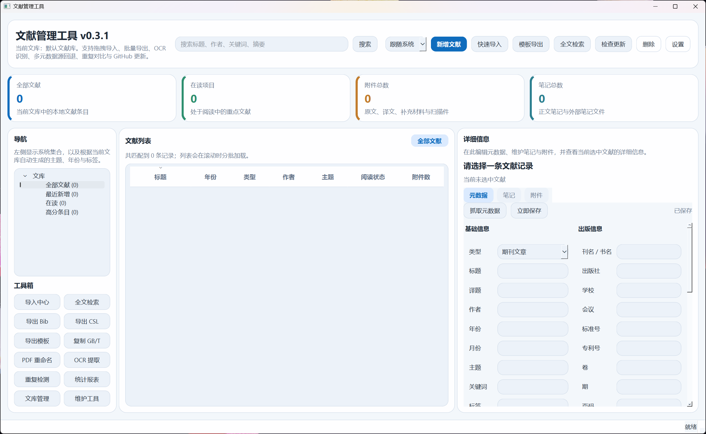
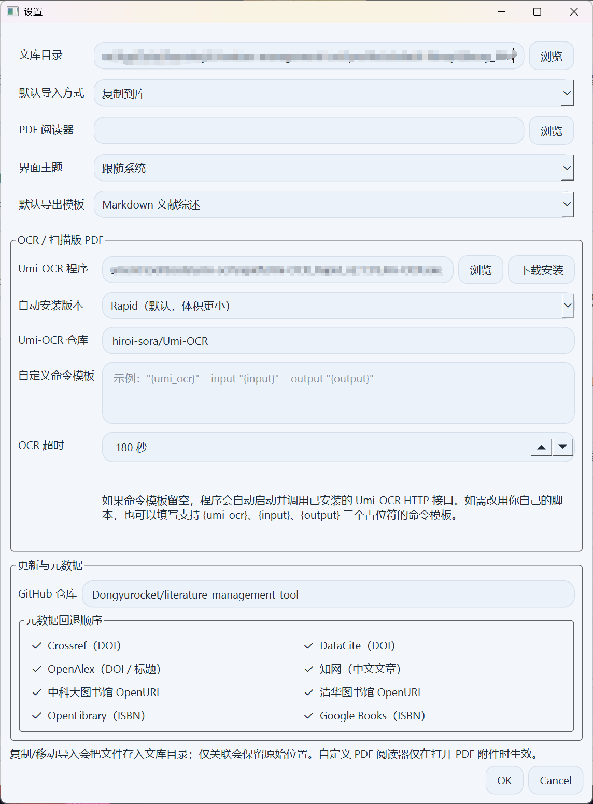

<h1 align="center">
  文献管理工具<br>
  <sub>Literature Management Tool</sub>
</h1>

<p align="center">
  <strong>本地优先的桌面文献管理软件，为中文学术场景而生</strong>
</p>

<p align="center">
  
  
  
  
  
  
</p>

<p align="center">
  <a href="https://github.com/Dongyurocket/literature-management-tool/releases/latest">下载安装包</a>&nbsp;&nbsp;·&nbsp;&nbsp;
  <a href="https://github.com/Dongyurocket/literature-management-tool">仓库主页</a>&nbsp;&nbsp;·&nbsp;&nbsp;
  <a href="https://github.com/Dongyurocket/literature-management-tool/issues">问题反馈</a>
</p>

---

面向研究生、教师、工程师和需要长期维护 PDF / 笔记 / BibTeX 数据的用户。使用 **Python + PySide6 + SQLite + pypdf** 构建，默认本地存储，无需服务器，开箱即用。

<br>

<p align="center">
  
</p>

<p align="center"><sub>主界面：导航树 · 文献列表 · 元数据编辑 · 工具箱</sub></p>

---

## 功能亮点

<table>
<tr>
<td width="50%" valign="top">

### 文献与元数据
- GB/T 7714-2015 全字段覆盖（副标题、译题、编者、译者、出版地、学位类别等）
- 多源元数据抓取（Crossref · DataCite · OpenAlex · 知网 · USTC/THU OpenURL · OpenLibrary · Google Books）
- 按配置顺序逐一回退，命中即停
- 元数据编辑按文献类型动态收敛，只显示对应字段
- DOI / ISBN / 标题自动补全
- BibTeX · RIS · PDF · DOCX · Markdown 导入

</td>
<td width="50%" valign="top">

### 文件与笔记
- 自定义文献库目录，支持 copy / move / link 三种导入
- 原文 · 译文 · 补充材料多附件关联
- 内置文本笔记 + 外部 docx / md / txt 笔记
- 笔记内容参与全文检索
- PDF 按规则批量重命名

</td>
</tr>
<tr>
<td width="50%" valign="top">

### 批量工具与导出
- BibTeX · CSL JSON · GB/T 文本导出
- Markdown / CSV / HTML 模板导出
- 统计报表（Markdown · JSON）
- 重复检测与字段级冲突合并
- 缺失路径扫描与修复、备份恢复

</td>
<td width="50%" valign="top">

### 桌面体验
- PySide6 原生中文界面，支持主题切换
- 惰性表格加载，大批量数据滚动流畅
- 文件 / 文件夹拖拽导入
- 后台异步任务 + 非阻塞 toast 提示
- 多文库管理与归档
- 软件内一键检查更新

</td>
</tr>
</table>

---

## 快速开始

### 方式一：下载安装包（推荐）

前往 [最新 Release](https://github.com/Dongyurocket/literature-management-tool/releases/latest) 下载 `Setup.exe`。

> 安装包特性：中文安装向导 · 开始菜单快捷方式 · 可选桌面快捷方式 · 自带卸载入口 · 默认安装到用户目录，无需管理员权限。卸载时不会删除你的文献数据。

### 方式二：从源码运行

```bash
# 环境要求：Windows 10/11、Python 3.11+
python -m pip install -U pip
python -m pip install .
python main.py
```

开发与测试：

```bash
python -m pip install -e ".[dev]"
```

---

## 界面预览

<table>
<tr>
<td align="center" width="60%">
  
  <br><sub>主界面 — 导航、列表、详情编辑</sub>
</td>
<td align="center" width="40%">
  
  <br><sub>设置页 — 元数据源、OCR、更新</sub>
</td>
</tr>
</table>

---

## 核心功能详解

### 1. 文献信息管理

每条文献维护完整的结构化元数据，覆盖 GB/T 7714-2015 全字段，并按文献类型自动裁剪编辑项：

| 基础信息 | 类型专属信息 | 扩展信息 |
|---------|-------------|---------|
| 文献类型（期刊论文 / 图书 / 学位论文 / 会议论文 / 标准 / 专利 / 报告 / 网页 / 其他） | 期刊：刊名、卷、期、页码 | 主题、关键词、标签 |
| 标题、副标题、译题 | 图书：出版社、出版地、版次 | 摘要、简介、备注 |
| 作者（保留顺序）、译者、编者 | 学位论文：学校、授予地、学位类别 | 阅读状态、评分、引用键 |
| 年、月、日、DOI、ISBN、URL | 会议 / 标准 / 专利 / 报告 / 网页：会议地点、标准号、专利号、报告号、访问日期等 | 语言、国家 / 地区 |

### 2. 元数据抓取与补全

- 支持 8 个元数据源，可在设置中自由勾选并排列优先级
- 按配置顺序逐一尝试，**命中即停**，避免无意义请求和多源混合
- DOI / ISBN 查询补全，查询失败时自动按标题回退检索
- 抓取结果会自动映射到当前文献类型对应字段，兼容副标题、编者、译者、出版地、学位类别等扩展字段
- 切换文献类型时自动隐藏并清空不适用字段，避免不同类型字段混填
- 支持从知网抓取中文文章元数据
- 支持从图书馆 OpenURL 解析器补充字段并保留检索链接

### 3. 文件与附件管理

每条文献可挂接多个文件（原文 · 译文 · 补充材料 · 数据文件 · 笔记文件），支持三种导入方式：

| 方式 | 说明 |
|-----|------|
| `copy` | 复制文件到文献库目录 |
| `move` | 移动文件到文献库目录 |
| `link` | 保留原始位置，仅记录关联 |

### 4. 笔记系统

- 内置文本笔记与外部笔记文件（docx / md / txt）混合使用
- 一条文献可维护多条笔记，每条笔记可关联多个附件
- 外部笔记支持内容预览与全文检索

### 5. 批量导出与引用

| 导出格式 | 用途 |
|---------|------|
| BibTeX (`.bib`) | LaTeX 引用 |
| CSL JSON (`.json`) | Zotero / 其他引用管理器 |
| GB/T 7714 文本 | 国标参考文献，可直接复制到剪贴板 |
| Markdown / CSV / HTML 模板 | 文献综述、目录、阅读报告 |
| 统计报表 (Markdown / JSON) | 文库数据分析 |

### 6. PDF 批量重命名

按规则自动重命名：`作者_年份_标题_Original.pdf` / `作者_年份_标题_Translation.pdf`，同名冲突自动追加序号。

### 7. OCR 与扫描版 PDF

- 内置 Umi-OCR 下载安装（Rapid / Paddle 两个发布包可选）
- 自动定位 Umi-OCR 程序并调用 HTTP 文档识别接口
- 也可自定义 OCR 命令模板（`{umi_ocr}` · `{input}` · `{output}` 占位符）
- PDF 内置文本不足时，自动尝试 OCR 补充

### 8. 检索、查重与维护

- **全文检索**：覆盖元数据、文本笔记、docx 笔记、PDF 提取文本
- **重复检测**：字段级冲突对比与合并预览
- **路径修复**：丢失路径扫描 + 指定新目录批量修复
- **备份恢复**：完整数据库与文献库备份
- **索引重建**：搜索索引一键重建

### 9. 多文库与归档

| 特性 | 说明 |
|-----|------|
| 独立数据库 | 每个文库拥有独立的 `library.sqlite3` |
| 独立设置 | 每个文库拥有独立的 `settings.json` |
| 快速切换 | 主界面直接切换当前文库 |
| 归档库 | 不常用文库标记为归档，从日常工作流中隐藏 |

### 10. 软件内更新

点击「检查更新」即可从 GitHub Release 获取新版本信息，查看更新日志并下载安装包。

---

## 首次使用

1. 打开**设置**，指定**文献库目录**和默认导入方式
2. 按需配置 **PDF 阅读器**路径
3. 如需扫描版 PDF 识别，在 `OCR / 扫描版 PDF` 中点击**下载安装**
4. 确认 GitHub 仓库配置（用于检查更新）
5. 开始创建文献或导入已有资料

---

## 典型工作流

<details>
<summary><b>手动录入文献</b></summary>

1. 点击「新建文献」
2. 填写标题、作者、年份等字段
3. 添加原文 / 译文附件
4. 在笔记区添加文本笔记或关联外部笔记
</details>

<details>
<summary><b>批量导入已有资料</b></summary>

1. 点击「导入中心」或直接拖拽文件 / 文件夹到主窗口
2. 审核扫描结果，选择导入方式（复制 / 移动 / 仅关联）
3. 执行导入
</details>

<details>
<summary><b>使用 DOI / ISBN 补全元数据</b></summary>

1. 选中文献 → 点击「抓取元数据」
2. 自动或手动输入 DOI / ISBN
3. 预览补全结果 → 应用缺失字段
</details>

<details>
<summary><b>批量导出 BibTeX</b></summary>

1. 在主列表中多选文献
2. 点击「导出 Bib」→ 选择输出位置
3. 生成 `.bib` 文件
</details>

<details>
<summary><b>路径修复</b></summary>

1. 打开「维护工具」→ 刷新缺失文件列表
2. 选择可能的新目录 → 执行修复扫描
</details>

---

## 数据存储

程序默认采用本地存储，数据目录为 `%APPDATA%\Literature management tool`：

```
Literature management tool/
├── library_registry.json        # 文库注册表
└── profiles/
    └── <slug>/
        ├── library.sqlite3      # 文库数据库
        └── settings.json        # 文库设置
```

可通过环境变量 `LITERATURE_MANAGER_HOME` 自定义数据目录。

---

## 技术架构

```
literature_manager/
├── controllers/         # 业务流程协调（数据库、导入、查重、维护、导出）
├── viewmodels/          # 为 Qt 视图整理导航、表格行和详情展示数据
├── views/               # 主窗口、对话框、主题、toast、搜索条、异步任务
│   ├── async_worker.py  # 带取消机制的后台任务
│   └── components/      # 可复用 UI 组件
├── models/              # QAbstractTableModel 数据模型
├── db.py                # SQLite 持久化（WAL 模式 + 索引优化）
├── metadata_service.py  # 多源元数据抓取与合并
├── ocr_service.py       # Umi-OCR 集成
├── import_service.py    # 多格式导入（bib / ris / pdf / docx / md / txt）
├── export_service.py    # 多格式导出
├── dedupe_service.py    # 查重与合并
├── maintenance_service.py # 备份恢复、路径修复、索引重建
├── desktop.py           # 本地文件操作、PDF 阅读器调用
├── config.py            # 配置管理
└── qt_app.py            # 应用入口
```

**设计原则**：MVVM 分层 · Controller 隔离数据库连接避免跨线程冲突 · 异步 Worker 带取消机制防闪退 · 信号槽生命周期安全管理

---

## 本地打包

### 生成 Windows 安装包

```bash
# 安装依赖
python -m pip install -e ".[dev]"

# 安装 Inno Setup
winget install --id JRSoftware.InnoSetup -e --accept-source-agreements --accept-package-agreements

# 执行打包
powershell -ExecutionPolicy Bypass -File .\scripts\build_windows.ps1 -Version 0.6.0
```

输出：
- `dist\Literature management tool\` — PyInstaller 可运行目录
- `dist\Literature-management-tool-v0.6.0-Setup.exe` — Windows 安装包

### GitHub Actions 自动发布

推送 `v*` 标签时，GitHub Actions 自动在 Windows runner 上构建并上传 `Setup.exe` 到对应 Release。

工作流配置：`.github/workflows/build-windows-release.yml`

---

## 测试

```powershell
# 安装开发依赖
python -m pip install -e ".[dev]"

# 运行全量单元测试
$env:QT_QPA_PLATFORM='offscreen'
python -m unittest discover -s tests -v    # 61 tests

# 或使用 pytest
python -m pytest -q

# 语法检查
python -m compileall main.py literature_manager
```

---

## 更新日志

<details>
<summary><b>V0.6.1</b> — 详细信息保存策略与列表列配置升级</summary>

- 详细信息区改为“立即保存 + 自动保存”并存，新增自动保存开关与保存间隔设置
- 自动保存关闭后，编辑中会明确显示“未保存”，切换记录、刷新列表或关闭窗口前会补做一次保存，降低内容丢失风险
- 文献列表新增“列设置”，可自由选择显示哪些列、调整列顺序，并持久化记录列宽
</details>

<details>
<summary><b>V0.6.0</b> — GB/T 7714 元数据字段补全</summary>

- 元数据模型补齐 GB/T 7714-2015 所需字段，新增副标题、编者、译者、出版地、机构、会议地点、学位类别、版次、报告号、访问日期等字段
- 元数据编辑区改为按文献类型动态显示，只保留当前类型需要填写的字段，并在切换类型时自动清理不适用内容
- 抓取、预览、合并、BibTeX / RIS 解析、GB/T / CSL 导出全部兼容上述字段扩展，抓取后仍可正确落入对应类型字段
</details>

<details>
<summary><b>V0.5.1</b> — 更新提示文案与时间显示优化</summary>

- 检查更新走备用通道时，不再展示 HTTP 403 等技术细节，统一改为更易理解的中文提示
- Release 发布时间改为按本机时区显示，本地查看时可直接看到形如 `2026-03-15 15:54:49` 的时间
- 保留备用通道回退能力，受限网络下仍可继续完成版本检查
</details>

<details>
<summary><b>V0.5.0</b> — 后台任务稳定性与发布整理</summary>

- 主窗口关闭时会主动取消后台任务、等待线程池收尾，并补做未落盘的元数据保存
- 同名后台任务增加去重保护，取消后的任务结果不再回写 UI，减少重复点击和退出时的异常提示
- PDF 元数据读取、PDF 文本抽取、Umi-OCR 探测与 OCR 回退流程增加日志，便于定位打包环境或用户现场问题
- README 重写为面向发布的中文说明，补齐安装、打包、测试与 Release 流程文档
</details>

<details>
<summary><b>V0.4.0</b> — 元数据源有序回退</summary>

- 设置页恢复元数据源多选，可自由勾选并排列回退优先级
- 元数据抓取按配置顺序逐一尝试，命中即停
- 保留来源顺序保存逻辑，重开设置后不丢失优先级配置
- 延续 v0.3.5 的安装包启动修复和 Pillow 兼容性改进
</details>

<details>
<summary><b>V0.3.5</b> — 启动稳定性热修复</summary>

- 修复 PIL 模块不完整导致 `module 'PIL' has no attribute '__version__'` 启动崩溃
- 打包规格文件显式收集完整的 Pillow / PIL 模块
- 运行时依赖补充 Pillow
</details>

<details>
<summary><b>V0.3.4</b> — 开发体验与数据库优化</summary>

- 新增 `dev` extra，一次安装开发、测试和打包依赖
- SQLite 启用 WAL，增加 year / subject / reading_status 索引
- ViewModel 新增元数据保存等封装，降低 View 对 Controller 的耦合
- 元数据页增加脏检查，未改动时不触发写库
</details>

<details>
<summary><b>V0.3.3</b> — 更新检查稳定性</summary>

- 检查更新支持 API 403 / 429 时自动回退到 Release 网页解析
- 支持 GITHUB_TOKEN / GH_TOKEN 提升受限网络成功率
</details>

<details>
<summary><b>V0.3.2</b> — 列表刷新与状态恢复</summary>

- 文献列表刷新（按钮 + F5 快捷键）
- 后台任务状态守护，异常残留自动恢复
- 元数据合并优化：替换占位标题、作者去重、关键词去重
- 引用键支持手动编辑并自动保存
</details>

---

## 已知限制

- Umi-OCR 首次下载体积较大，需保持网络可用
- PDF 元数据抽取为尽力而为，部分扫描版 PDF 需配合 OCR
- 查重合并策略偏保守，需人工确认
- 当前不包含云同步

---

## 隐私与安全

- 所有文献数据默认保存在本地
- DOI / ISBN 补全仅发送查询标识到外部服务
- 备份文件可能包含原始文献，请妥善保管
- 提交代码前请确认未包含个人资料或文献原文

---

## 后续方向

- 更丰富的导出模板自定义能力
- 更细的 OCR 参数面板与任务日志
- 更强的批量元数据清洗规则
- 更完整的合并冲突编辑器
- 可选的局域网同步或团队协作

---

<p align="center">
  本项目采用 <a href="LICENSE">MIT License</a> 开源
</p>
